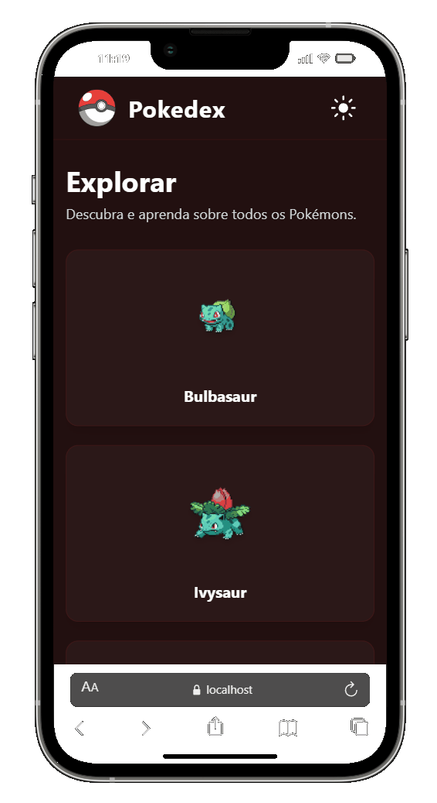

<h1 align="center">
    Pokédex React – SPA com PokeAPI
</h1>

Aplicação desenvolvida como Single Page Application (SPA) para listar Pokémons utilizando a PokeAPI, com sistema de tema claro/escuro e página de detalhes dinâmica.

---

## 📄 Descrição

Este projeto consiste em uma Pokédex desenvolvida com React, consumindo dados da API pública PokeAPI.

A aplicação possui uma página inicial que lista os 10 primeiros Pokémons e permite carregar mais 10 ao clicar no botão "Carregar mais". Cada Pokémon é clicável e direciona para uma página interna com informações detalhadas.

Também foi implementado um alternador de tema (Light/Dark) utilizando Context API.

O objetivo principal foi praticar:

- Consumo de API REST
- Criação de SPA
- Rotas dinâmicas
- Gerenciamento de estado global com Context API
- Componentização
- Estilização com TailwindCSS

---

## 🔗 Preview

<div align="center">

  ### Mobile 📱  
  

  <br>
  
  ### Desktop 💻
  
</div>

<br>


🚀 Deploy do projeto:
<a href="https://pokedex-project-hazel.vercel.app/" target="_blank">Deploy</a>


---

## 🚀 Tecnologias Utilizadas

- React
- TypeScript
- React Router DOM
- Context API
- Fetch API
- Tailwind CSS
- Vite

---

## ⚙️ Funcionalidades

### 🏠 Página Inicial

- Listagem inicial com 10 Pokémons
- Exibição de:
  - Nome
  - Imagem
- Botão "Carregar mais" que adiciona mais 10 Pokémons à lista
- Navegação para página de detalhes
- Alternador de tema Light/Dark

### 📄 Página de Detalhes

Exibe informações completas do Pokémon selecionado:

- Imagem
- Nome
- Tipo (type)
- Lista de movimentos (moves)
- Lista de habilidades (abilities)
  - Nome da habilidade
  - Descrição detalhada da habilidade

---

## 🌓 Tema Claro e Escuro

O alternador de tema foi implementado utilizando:

- Context API para estado global
- TailwindCSS para estilização condicional

---

## ▶️ Como rodar o projeto localmente

Siga os passos abaixo para rodar o projeto em sua máquina:

```bash
# Clone o repositório
git clone https://github.com/MadeiraVitor/pokedex-project.git

# Acesse a pasta do projeto
cd pokedex-project

# Instale as dependências
npm install

# Inicie o servidor de desenvolvimento
npm run dev
```
O projeto estará disponível em:
http://localhost:5173

## 📚 Aprendizados
Durante o desenvolvimento deste projeto, foi possível praticar:

- Consumo de API REST com React
- Paginação incremental
- Uso de useState e useEffect
- Rotas dinâmicas com useParams
- Gerenciamento de estado global com Context API
- Criação de SPA
- Organização de componentes
- Renderização condicional
- Alternância de temas com TailwindCSS

## 👤 Autor
<div align="center">
    <p>Desenvolvido por <strong>Vitor Madeira</strong></p>
    <a href="https://www.linkedin.com/in/vitor-madeira/" target="_blank"></a>
    <a href = "mailto:vitorsoutom@hotmail.com"></a>
</div>

